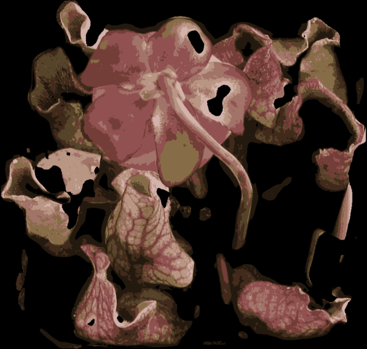

# pytcher-plants

Python/OpenCV geometric trait and color analysis for top-down images of pitcher plants.



<!-- START doctoc generated TOC please keep comment here to allow auto update -->
<!-- DON'T EDIT THIS SECTION, INSTEAD RE-RUN doctoc TO UPDATE -->


- [Project layout](#project-layout)
- [Approach](#approach)
- [Setting up a development environment](#setting-up-a-development-environment)
  - [Requirements](#requirements)
  - [Installing dependencies](#installing-dependencies)
    - [venv](#venv)
    - [Anaconda](#anaconda)
    - [Docker](#docker)
  - [Running the code](#running-the-code)
    - [Jupyter notebooks](#jupyter-notebooks)
    - [Python CLI](#python-cli)
      - [Processing (image analysis)](#processing-image-analysis)
      - [Post-processing (aggregations)](#post-processing-aggregations)

<!-- END doctoc generated TOC please keep comment here to allow auto update -->

Developed for a fertilization experiment performed by [Mason McNair](https://github.com/mmcnair91) at the University of Georgia. Segmentation and analysis adapted from [SMART](https://github.com/Computational-Plant-Science/SMART) (Speedy Measurement of Arabidopsis Rosette Traits) by [Suxing Liu](https://github.com/lsx1980), also at UGA.

## Project layout

Jupyter notebooks detailing methods are in `notebooks`. A few test photos are included in `testdata`. A Python CLI exposing commands for image analysis and postprocessing/aggregations is provided in `scripts`. <!--A `Snakefile` is also provided, encapsulating a Snakemake pipeline which invokes the Python CLI to process individual images in parallel before computing aggregate statistics.-->

## Approach

First each image is preprocessed individually to detect and segment pots and pitchers. The number of pots per image can be provided on the command line or automatically inferred. A series of preprocessing steps are applied including Gaussian blur and an adaptive threshold to, followed by segmentation via contour detection and a hue filter. Once individual pots and the plants within have been distinguished, each is cropped for individual analysis. K-means clustering is used to quantize the image of each plant in RGB-space, assigning to each pixel a centroid value corresponding to the nearest color cluster. This yields a reduced image with $k$ distinct colors. Pixels are then counted and frequencies recorded, grouped by plant, timestamp, and fertilizer treatment.

Next are several steps to analyze color and basic geometric traits over the entire image set and duration of the experiment. At each time point, k-means clustering is applied to the RGB distribution corresponding to each treatment. Pixels are also binned according to hue. This permits questions like: "Is red pitcher tissue (presumably indicating health/vigor) more prevalent under any of the fertilizer treatments?"

## Setting up a development environment

Clone the repo with `git clone https://github.com/w-bonelli/pitcherplants.git`.

### Requirements

Python3.6+ with the packages in `requirements.txt`. A few options for setting up an environment:

- `venv`
- Anaconda
- Docker/Singularity

### Installing dependencies

Anaconda or Python3's built-in venv utility can be used to create a virtual environment. Alternatively there is an image available on Docker Hub: `wbonelli/pytcher-plants`.

#### venv

From the project root, run `python3 -m venv` to create a virtual environment, then activate it with `source bin/activate`. Dependencies can then be installed with pip, e.g. `pip install -r requirements.txt`. The environment can be deactivated with `source deactivate`.

#### Anaconda

Create an environment:

```shell
conda create --name <your environment name> --file requirements.txt python=3.8 anaconda
```

Any Python3.6+ should support the dependencies in `requirements.txt`. The environment can be activated with `source activate <your environment name>` and deactivated with `source deactivate`.

#### Docker

There is a preconfigured Docker image available on the Docker Hub at `wbonelli/pytcher-plants`. From the project root, run:

```shell
docker run -it -p 8888:8888 -v $(pwd):/opt/dev -w /opt/dev wbonelli/pytcher-plants bash
```

This will pull the image definition (if you don't already have it) and start a container, mounting the project root into the container's working directory. It also opens port 8888 in case you want to use Jupyter.

### Running the code

#### Jupyter notebooks

A Jupyter server can be started with `jupyter notebook` from the project root. (If you're using Docker, add flags `--no-browser --allow-root`.)

This will serve the project at `localhost:8888`. Then navigate to the `notebooks` directory, open a notebook, and refer to [the Jupyter docs](https://jupyter.org/documentation) if unfamiliar.

#### Python CLI

The Python CLI can be invoked with `pytcher_plants/cli.py`. This script includes commands for processing one more image files as well as post-processing/aggregations after images are analyzed.

##### Processing (image analysis)

```shell
python3 pytcher_plants/cli.py process -i <input file or directory> -o <output directory>
```

By default JPG and PNG files are supported. You can select one or the other by passing `png` or `jpg` to the `--filetypes` flag (shorthand `-ft`).

You can also specify the number of plants per image by providing an integer `--count`. If this argument is not provided, the software will keep the top $n$ largest contours, of those with area greater than a threshold value `--min_area` (if this value is not provided, an area equivalent to a (w/5)x(h/5) square is used).

##### Post-processing (aggregations)

```shell
python3 pytcher_plants/cli.py postprocess -i <input file or directory> -o <output directory>
```

