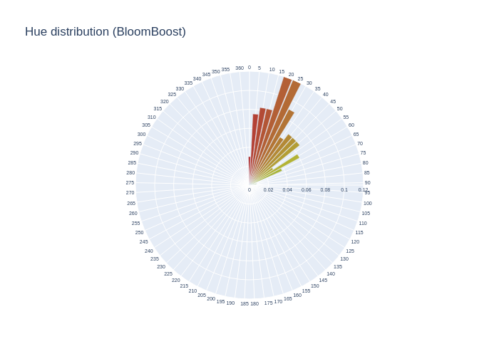
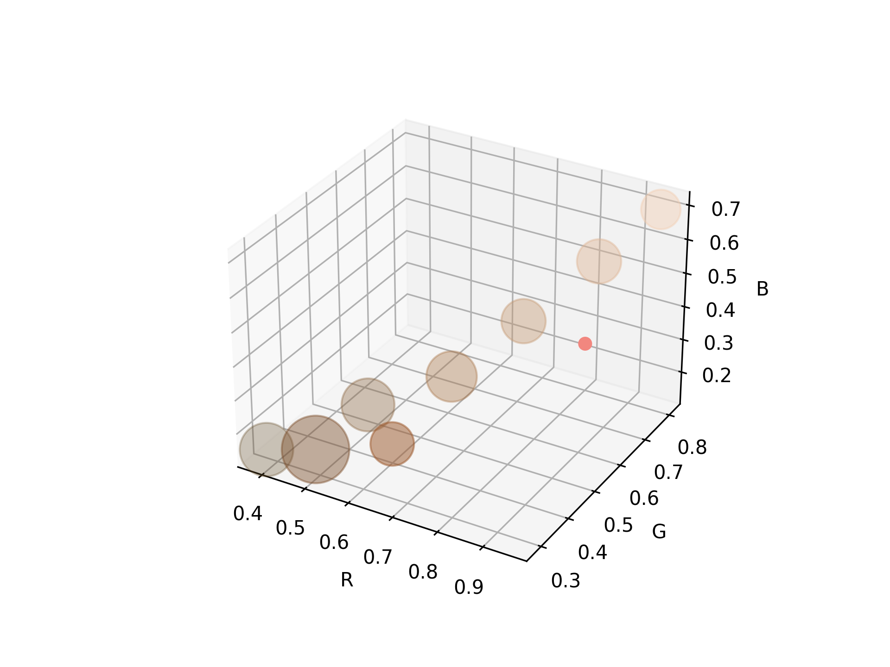
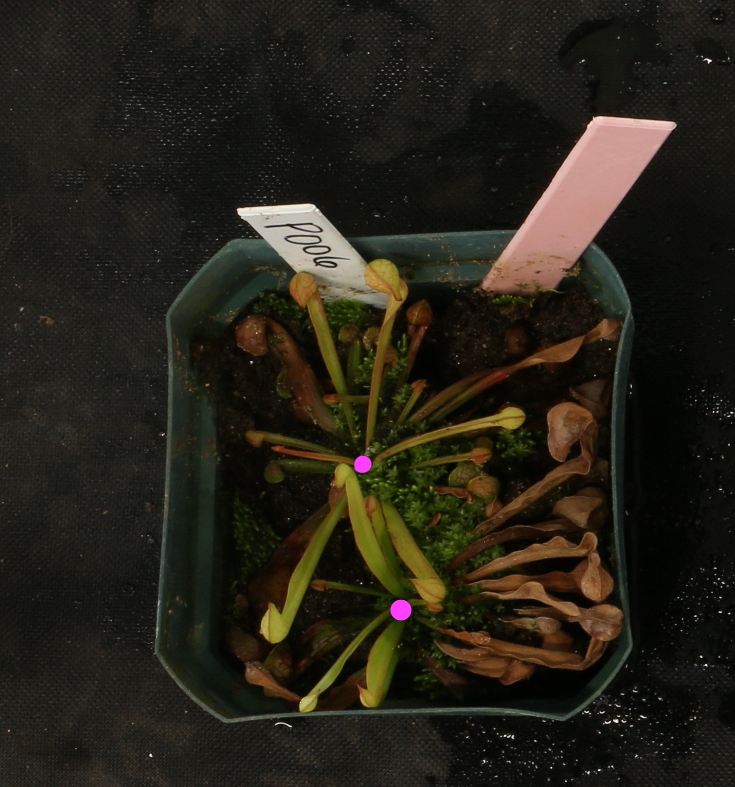

# pytcherplants


[](https://coveralls.io/github/w-bonelli/pytcherplants?branch=main)


Geometric trait and color analysis for top-down images of pitcher plants, built on top of [ilastik](https://www.ilastik.org/), [OpenCV](https://github.com/opencv/opencv-python), and [Deep Plant Phenomics](https://github.com/p2irc/deepplantphenomics).

Pot Segmentation             |            Color Analysis             | Growth Point Estimation | Geometric Traits | 
:----------------------------:|:-------------------------------------:|:-----------------------:|:----------------:|
  |   |        |       TODO       

<!-- START doctoc generated TOC please keep comment here to allow auto update -->
<!-- DON'T EDIT THIS SECTION, INSTEAD RE-RUN doctoc TO UPDATE -->

- [Project layout](#project-layout)
- [Approach](#approach)
- [Setting up a development environment](#setting-up-a-development-environment)
  - [Requirements](#requirements)
  - [Installing dependencies](#installing-dependencies)
    - [venv](#venv)
    - [Anaconda](#anaconda)
    - [Docker](#docker)
  - [Running the code](#running-the-code)
    - [Jupyter notebooks](#jupyter-notebooks)
    - [Python CLI](#python-cli)
      - [Processing (image analysis)](#processing-image-analysis)
      - [Post-processing (aggregations)](#post-processing-aggregations)
      - [Detecting growth point labels](#detecting-growth-point-labels)

<!-- END doctoc generated TOC please keep comment here to allow auto update -->

Developed for images obtained from an experiment performed by [Mason McNair](https://github.com/mmcnair91) at the University of Georgia. Segmentation strategy (via [Ilastik](https://www.ilastik.org/) pixel classification) adapted from [Peter Pietrzyk's](https://github.com/PeterPieGH) [DIRTmu](https://github.com/Computational-Plant-Science/DIRTmu) project. Color and trait analysis adapted from [SMART](https://github.com/Computational-Plant-Science/SMART) (Speedy Measurement of Arabidopsis Rosette Traits) by [Suxing Liu](https://github.com/lsx1980).

## Project layout

Jupyter notebooks detailing methods are in `notebooks`. A few test photos are included in `data`. A Python CLI exposing commands for image analysis and postprocessing/aggregations is provided in `scripts`. <!--A `Snakefile` is also provided, encapsulating a Snakemake pipeline which invokes the Python CLI to process individual images in parallel before computing aggregate statistics.-->

## Approach

This repository currently provides functions for color distribution analysis. A few more features are under development, but not yet complete:

- growth point counting via density estimation
- pitcher counting, semantic segmentation, & traits

### Color analysis

First each image is preprocessed and pots are segmented. The number of pots per image can be provided on the command line, otherwise it is automatically inferred. A series of preprocessing steps are first applied including Gaussian blur and an adaptive threshold, followed by contour detection and a hue filter. Once individual pots and the plants within have been distinguished, each is cropped for individual analysis. K-means clustering is used to assign each pixel to a centroid in RGB-space (corresponding to the nearest color cluster). This yields a reduced image with k distinct colors. Pixels are counted and frequencies recorded, grouped by plant, timestamp, and fertilizer treatment. Next, another round of k-means clustering is applied separately to the (RGB) pixel distribution corresponding to each treatment. Pixels are also binned according to hue.

### Growth points

**This feature is still in developement.**

Several methods are compared for estimating growth point locations, including:

- convex hull centroid
- skeletonization, root node estimation
- density estimation via convolutional neural net

Growth points are useful in turn for estimating average pitcher length per plant/pot, even in the absence of semantic pitcher segmentation: the average distance from growth point to convex hull boundary doesn't seem an unreasonable proxy.

#### Centroid of convex hull

A convex hull is computed around the plant after background and pot pixels have been removed, then its centroid is interpreted as the likeliest growth location on the assumption that pitcher length tends toward a uniform distribution. With this method we also assume each pot has just 1 growth point.

#### Root node of skeletonized graph

A binary skeletonization is obtained for each plant after background and pot pixels are removed, then an estimate of its graph structure is extracted and we attempt to determine the root node's location.

#### CNN density estimation: heatmap object counting

A convolutional neural net, modeled on the Deep Plant Phenomics project's example, is used here for density estimation. This produces a 2-dimensional Gaussian distribution over the cropped image of each pot: a heatmap showing locations the model considers the likeliest growth points.

### Pitcher segmentation & traits

**This feature is still in development.**

TODO

## Setting up a development environment

Clone the repo with `git clone https://github.com/w-bonelli/pitcherplants.git`.

### Requirements

Python3.6+ with the packages in `requirements.txt`. A few options for setting up an environment:

- `venv`
- Anaconda
- Docker/Singularity

### Installing dependencies

Anaconda or Python3's built-in venv utility can be used to create a virtual environment. Alternatively there is an image available on Docker Hub: `wbonelli/pytcher-plants`.

#### venv

From the project root, run `python3 -m venv` to create a virtual environment, then activate it with `source bin/activate`. Dependencies can then be installed with pip, e.g. `pip install -r requirements.txt`. The environment can be deactivated with `source deactivate`.

#### Anaconda

Create an environment:

```shell
conda create --name <your environment name> --file requirements.txt python=3.8 anaconda
```

Any Python3.6+ should support the dependencies in `requirements.txt`. The environment can be activated with `source activate <your environment name>` and deactivated with `source deactivate`.

#### Docker

There is a preconfigured Docker image available on the Docker Hub at `wbonelli/pytcher-plants`. From the project root, run:

```shell
docker run -it -p 8888:8888 -v $(pwd):/opt/dev -w /opt/dev wbonelli/pytcher-plants bash
```

This will pull the image definition (if you don't already have it) and start a container, mounting the project root into the container's working directory. It also opens port 8888 in case you want to use Jupyter.

### Running the code

#### Jupyter notebooks

A Jupyter server can be started with `jupyter notebook` from the project root. (If you're using Docker, add flags `--no-browser --allow-root`.)

This will serve the project at `localhost:8888`. Then navigate to the `notebooks` directory, open a notebook, and refer to [the Jupyter docs](https://jupyter.org/documentation) if unfamiliar.

#### Python CLI

The Python CLI can be invoked with `pytcher_plants/cli.py`. This script includes commands for processing one more image files as well as post-processing/aggregations after images are analyzed.

###### Image names

The various CLI commands expect image file names to conform to the scheme `date.treatment.name.ext`, where dates are `_`-delimited integer triples `month_day_year`. For instance:

- `10_14_19.Calmag.5V4B9763.jpg`
- `1_14_19.bloomboost.5V4B3121.JPG`

##### Preprocessing (pot segmentation, initial color clustering, pixel counting)

```shell
python pytcher_plants/cli.py preprocess -i <input file or directory> -o <output directory>
```

By default JPG and PNG files are supported. You can select one or the other by passing `png` or `jpg` to the `--filetypes` flag (shorthand `-ft`).

You can also specify the number of plants per image by providing an integer `--count`. If this argument is not provided, the software will keep the top $n$ largest contours, of those with area greater than a threshold value `--min_area` (if this value is not provided, an area equivalent to a (w/5)x(h/5) square is used).

##### Color analysis

After processing all image files individually, the `postprocess` command can be used on the files produced by the `process` command to compute color distributions and geometric traits.

```shell
python pytcher_plants/cli.py colors analyze -i <input file or directory> -o <output directory>
```

##### Growth points

A command is provided to detect manually labeled growth points, find their coordinates, and write them to CSV for ingestion into a [heatmap-based counting dataset for use with a model trained with Deep Plant Phenomics](https://deep-plant-phenomics.readthedocs.io/en/latest/Loaders/#load-heatmap-based-counting-dataset-from-directory). For instance, the following will produce the `labels.csv` file included in `data/labels/growth_points`, run on the images included in that folder:

```shell
python pytcher_plants/base.py gpoints load_labels -i <input file or directory> -o <output directory> -c '#ea57f5'
```

TODO: train command
